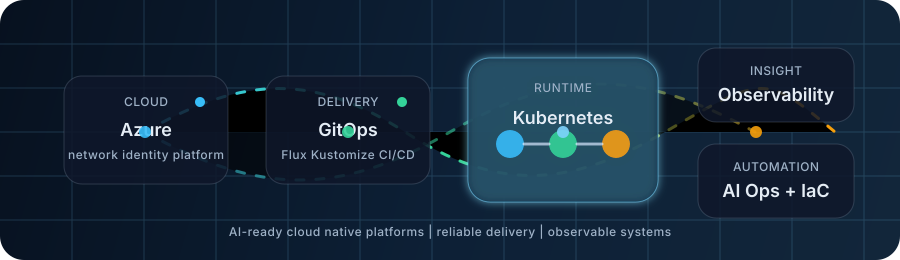

# Abhishek Sharma

**DevOps Engineer | Cloud Engineer | Azure | Kubernetes | GitOps | Observability**

  

I design, automate, and operate Azure and Kubernetes platforms with a practical focus on architecture, GitOps delivery, observability, reliability, and infrastructure as code.

---

## About Me

Cloud and DevOps engineer with 10+ years of experience building and supporting cloud, hybrid, and platform engineering systems. My core work is around Azure architecture, Kubernetes operations, GitOps workflows, infrastructure as code, and production observability.

I like practical engineering: clear architecture, repeatable deployments, useful dashboards, reliable alerts, and automation that reduces manual operational work.

## Engineering Scope

| Area | Practical focus |
| --- | --- |
| Azure architecture | VNets, App Gateway, Key Vault, Managed Identity, RBAC, secure platform patterns |
| Kubernetes platforms | Cluster operations, workload deployment, troubleshooting, reliability, and runtime standards |
| GitOps delivery | Flux, Kustomize, environment promotion, drift control, and declarative releases |
| Observability | Grafana dashboards, Prometheus metrics, ELK/Metricbeat logging, alerts, and operational visibility |
| Infrastructure as Code | Bicep, Terraform, reusable modules, validation, and compliance checks |
| Automation | Azure DevOps, GitHub Actions, Jenkins, scripting, and repeatable runbooks |

## What I Work On

- Azure cloud infrastructure, networking, identity, and platform automation
- Kubernetes application delivery, operations, and troubleshooting
- GitOps workflows with Flux and Kustomize for repeatable deployments
- Infrastructure as Code with Bicep and Terraform for reusable delivery
- Grafana and Prometheus observability for platform and application visibility
- Security and governance practices using Key Vault, Managed Identity, RBAC, and Checkov

## Tech Stack

| Area | Tools |
| --- | --- |
| Cloud | Azure, Azure DevOps, App Gateway, Key Vault, Managed Identity, VNet |
| Containers | Kubernetes, Docker, AKS, kind |
| IaC | Bicep, Terraform, ARM templates |
| GitOps | Flux, Kustomize |
| CI/CD | Azure Pipelines, GitHub Actions, Jenkins |
| Observability | Grafana, Prometheus, ELK, Metricbeat |
| Security | Checkov, RBAC, secrets management, compliance checks |
| Scripting | Python, Groovy, PowerShell, Bash |

  
  
  
  
  
  
  
  
  

## Featured Work

| Project | Focus |
| --- | --- |
| [KubeChaos](https://github.com/parzival92/KubeChoas) | Kubernetes troubleshooting and chaos engineering practice using Chaos Mesh, FastAPI, Typer, and kind. |
| [AzureTerraform](https://github.com/parzival92/AzureTerraform) | Terraform-based Azure infrastructure workflows, authentication patterns, and Key Vault provisioning examples. |
| [devops-governance](https://github.com/parzival92/devops-governance) | Azure governance reference covering RBAC, Terraform automation, Azure DevOps projects, service connections, and drift detection. |
| [ProductsStoreOnKubernetes](https://github.com/parzival92/ProductsStoreOnKubernetes) | Containerized ASP.NET Core and SQL Server application deployed to Kubernetes and AKS with CI/CD walkthroughs. |
| [CKA](https://github.com/parzival92/CKA) | Kubernetes administrator curriculum notes covering cluster architecture, workloads, networking, storage, and troubleshooting. |

## Experience Snapshot

**Globant India Pvt Ltd, Pune**  
Senior Level 1 | Jun 2021 - Present

- Manage production-grade Kubernetes platforms and Azure cloud infrastructure.
- Implement GitOps workflows with Flux and Kustomize for repeatable application delivery.
- Build reusable Bicep modules for App Gateway, Key Vault, VNets, Managed Identity, and related Azure services.
- Improve reliability through monitoring, operational automation, and self-healing patterns.

**Infosys Limited, Pune**  
Senior DevOps Engineer | Jan 2015 - Jun 2021

- Automated Azure DevTest Lab provisioning and operational workflows.
- Built logging and monitoring solutions with ELK and Metricbeat.
- Automated Atlassian platform maintenance with Groovy and supported Jira, Confluence, Bitbucket, Jenkins, CARA, and Chef.
- Delivered DevOps solutions for enterprise clients including UBS, Westpac, and Wells Fargo.

## Current Focus

- Azure reference architecture for secure and maintainable cloud platforms
- Kubernetes reliability, workload operations, and troubleshooting practice
- Flux-based GitOps delivery with clear environment and deployment structure
- Grafana dashboards, Prometheus metrics, logs, and alerting that support operations
- Bicep and Terraform modules for repeatable infrastructure delivery
- Practical automation for CI/CD, runbooks, and day-to-day platform operations

## GitHub Work

The profile avoids third-party GitHub stats cards because they can fail or rate-limit. These links point directly to GitHub-hosted activity and repositories.

| View | Link |
| --- | --- |
| Public repositories | [github.com/parzival92?tab=repositories](https://github.com/parzival92?tab=repositories) |
| Contribution activity | [github.com/parzival92](https://github.com/parzival92) |
| Kubernetes work | [KubeChaos](https://github.com/parzival92/KubeChoas), [CKA](https://github.com/parzival92/CKA), [ProductsStoreOnKubernetes](https://github.com/parzival92/ProductsStoreOnKubernetes) |
| Azure and IaC work | [AzureTerraform](https://github.com/parzival92/AzureTerraform), [devops-governance](https://github.com/parzival92/devops-governance), [AzureARMTemplates](https://github.com/parzival92/AzureARMTemplates) |

## Education

- B.E. in Computer Science, GBTU (Gautam Buddha Technical University), Lucknow, 2010 - 2014

## Beyond Work

Gaming, chess, photography/editing, and Formula 1.

## Connect

- LinkedIn: [abhishek-sharma-790a8b149](https://linkedin.com/in/abhishek-sharma-790a8b149)
- GitHub: [parzival92](https://github.com/parzival92)
- Email: [abhishdevops@gmail.com](mailto:abhishdevops@gmail.com)
- Location: Pune, India
